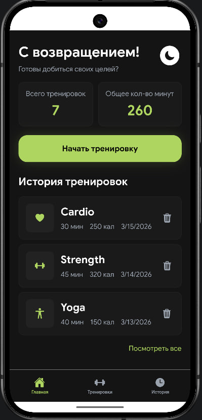
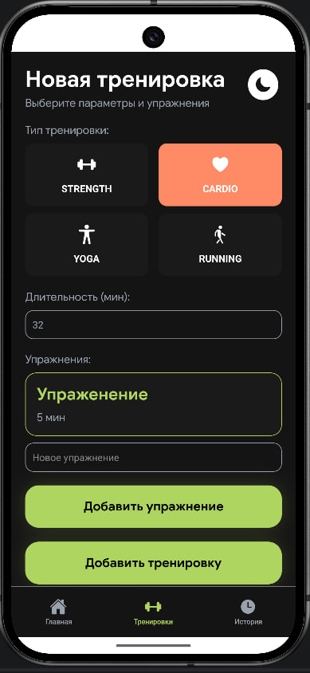
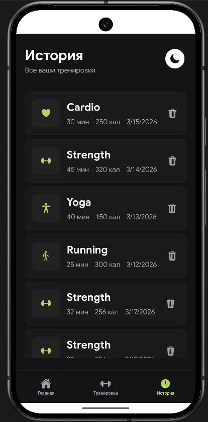
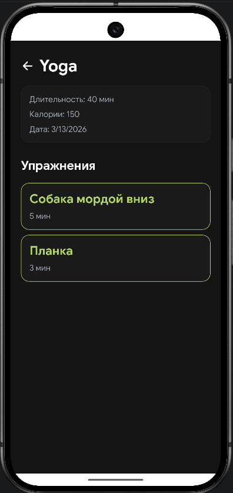
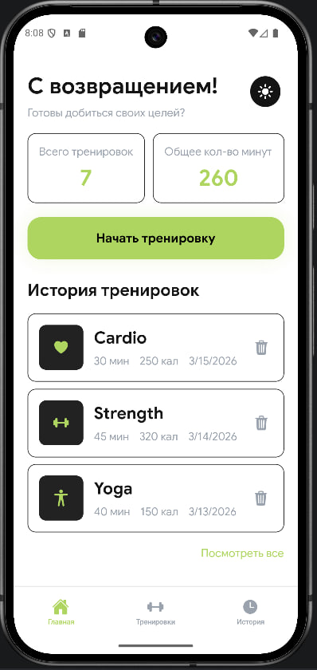

# 💪 Fitness Tracker App

Мобильное приложение для отслеживания тренировок, созданное на **React Native (Expo)**.
Позволяет записывать тренировки, отслеживать статистику и визуально наслаждаться плавным UI ✨

---

## 🚀 Функционал

* 🏋️ Добавление тренировок (тип, длительность, упражнения)
* 📊 Статистика:

  * общее количество тренировок
  * общее время
* 🗂 История тренировок
* ❌ Удаление тренировок
* 🌗 Переключение темы (светлая / тёмная)
* 🎬 Плавные анимации (Reanimated)

---

## 🧠 Технологии

* ⚛️ React Native (Expo)
* 🎨 TypeScript
* 🧩 Context API (глобальное состояние)
* 🎬 react-native-reanimated
* 🧭 React Navigation

---

## 📱 Скриншоты

### Главный экран



### Добавление тренировки



### История



### Детали тренировки



### Cvtyf ntvs


---

## ⚙️ Установка

```bash
git clone https://github.com/your-username/fitness-tracker.git
cd fitness-tracker
npm install
npx expo start
```

---

## 📁 Структура проекта

```
/components
/hooks
/screens
/store
/theme
```

---

## 🔥 Особенности

* 💡 Чистая архитектура
* ⚡ Быстрые анимации без лагов (UI thread)
* 🧼 Читаемый и масштабируемый код
* 📦 Готов к расширению (API / backend)

---

## 🚧 Планы на будущее

* 🔐 Авторизация
* ☁️ Синхронизация с сервером
* 📈 Графики прогресса
* 🎯 Цели и достижения
* 🔔 Напоминания

---

## 👩‍💻 Автор

Разработано Калмыковой А.М. в рамках обучения и прокачки навыков мобильной разработки.


